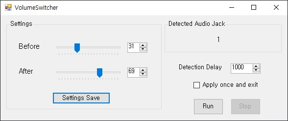
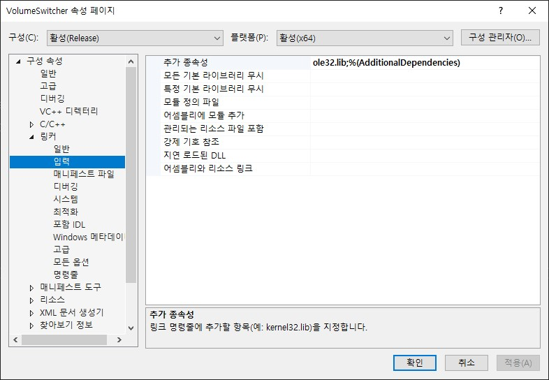

# VolumeSwitcher
Switching speaker volume when you connect audio jacks to your computer.

Before Volume -> After Volume -> Before Volume -> After Volume -> ...loop

- For x86 : this_repository\x86\Release\VolumeSwitcher.exe   
- For x64 : this_repository\x64\Release\VolumeSwitcher.exe   

When you execute this program, this program display the number of audio jacks(only green slot) connected to your computer in *Detected Audio Jack group box*. you can check how many jacks connected to your computer.

### Setting
- Before : This means current your speaker volume when you start this program. Once "After Volume" is applied, and the number of currently connected jacks are changed, your speaker volume will come back to this volume.

- After : This means speaker volume you want to change when the other audio jacks are connected/disconnected.

- Settings Save : Save button. A text file named "vcsave.txt" will be saved. values in the text file are automatically loaded when you start this program.

- Detection Delay : After you click "Run" button, this program repeatedly get the number of jacks connected to your computer. this value means the time interval in loop. 1000 = 1 second Recommended.

- Apply once and exit : Once speaker volume changes to after volume, exit program.   

# Build   

## Build Environment
- Language : C++ with CLI
- OS : Windows 10 64bit
- IDE : Visual Studio 2019 Community, 16.8.3
- .NET Framework : 4.7.2 version

### **If you want to build this solution, you must write ole32.lib in your IDE linker**
### For example, in Visual Studio 2019 Version, Project property - linker - input - additional dependency.

# LICENSE

MIT license
icon from here : https://icon-icons.com/ko/%EC%95%84%EC%9D%B4%EC%BD%98/%EB%9F%89-%EB%B0%94----%EB%91%A5%EA%B7%BC-%EA%B4%91%EC%9E%A5%EC%97%90%EC%84%9C-%EA%B2%80%EC%9D%80%EC%83%89-%EB%B0%8F-%ED%9D%B0%EC%83%89/70577 
